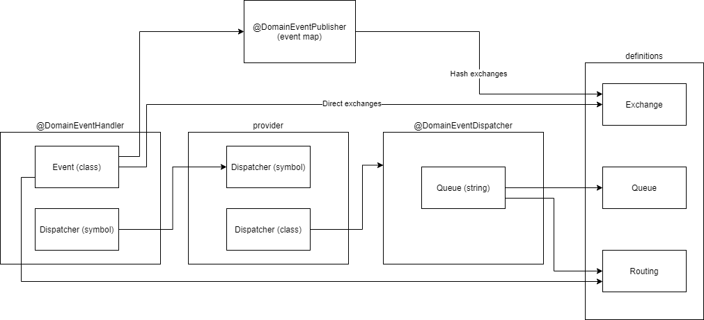

To start: `yarn --silent ts-node ./src/index.ts --vhost dev -o json -i '/home/leocode/Advisero/advisero-saas-api/dist/app.module' > result.json ` - correct path to compiled js source file with AppModule

reference: `rabbitmq-defgen` branch on `advisero-saas-api` for more information

# rabbitmq-defgen

CLI tool for generating rabbitmq definitions in various format (JSON, Terraform resources) directly out of application code.

Currently it supports only NestJS and requires specific decorators.

## Installation

`yarn add --dev @leocode/rabbitmq-defgen`

(it can be also installed globally and/or with `npm`)

## Usage

### Quick reference

Terraform output:

`yarn rabbitmq-defgen --vhost dev -o terraform -i ./dist/app.module.js > rabbitmq.tf`

JSON output:

`yarn rabbitmq-defgen --vhost dev --username rabbitmq --password rabbitmq -o json -i ./dist/app.module.js > rabbitmq.tf`

### Parameters

parameter | required | description
--- | --- | ---
--vhost | [x] | vhost parameter for which definitions will be generated
-o / --output | [x] | (terraform/json) determines export style
-i / --input | [x] | path to file with **build** root application NestJS module. **Expected to export named AppModule variable**
--username | json | username for vhost admin user
--password | json | password for vhost admin user

### Output

Everything is printed into `stdout` so can be saved in a file or used in a script

### Decorators

`rabbitmq-defgen` is able to build all queues by detecting certain decorators (which play nicely with other @leocode libraries).

We do not provide decorators (yet, probably, see [issue](https://github.com/leocode/rabbitmq-defgen/issues/1) for more info).
You can just copy them from the file: [readme-decorators.ts](./readme-decorators.ts).

Relation between decorators is outlined on the diagram:

Decorators described in the file also specify related metadata interfaces.
Upon them you can build logic for communicating with rabbitmq, or just create one provider with all decorators.

Remember, that all classes with decorators should be imported (as provider) somewhere in NestJS dependency tree relative to root module that you require in CLI.

### Caveats

`rabbitmq-defgen` basically requires the code, which executes it. If your code has any immediate side-effects **they will be executed**.

This can lead to some errors, like missing environment variables. It's up to user to create side-effects free code or provide any required variables.

